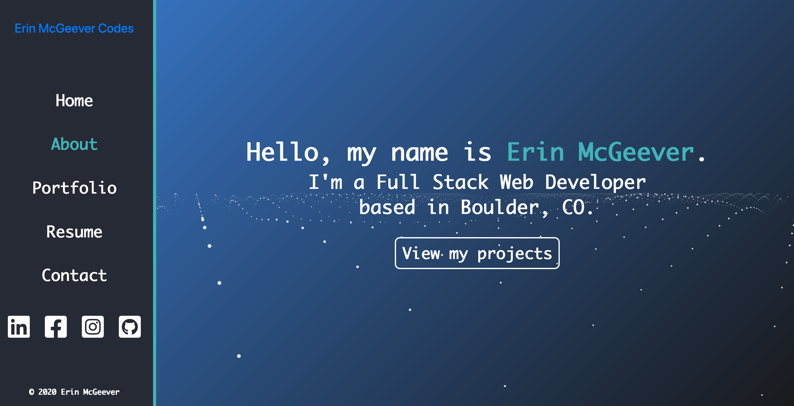
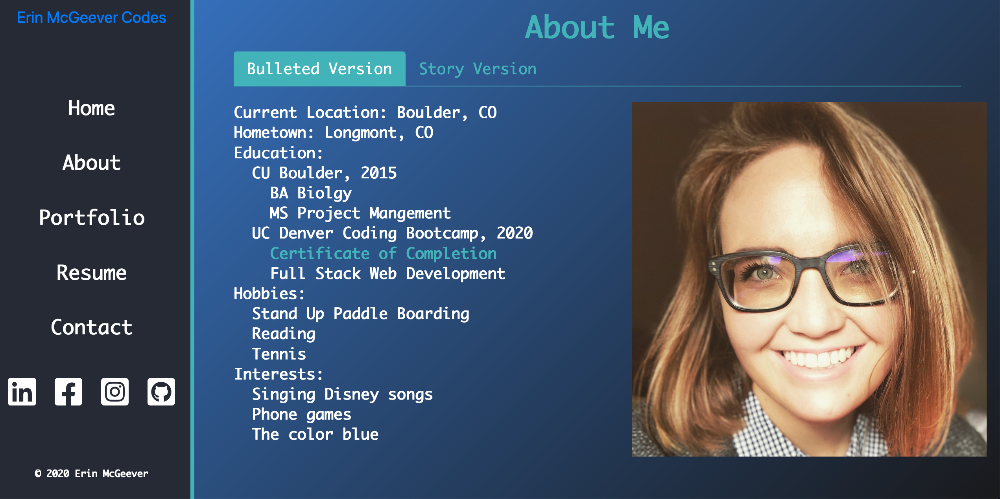
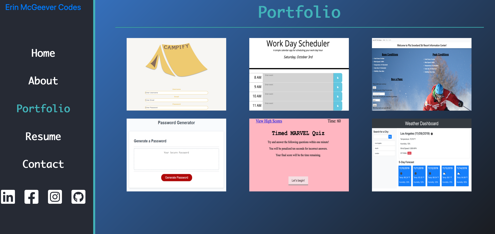
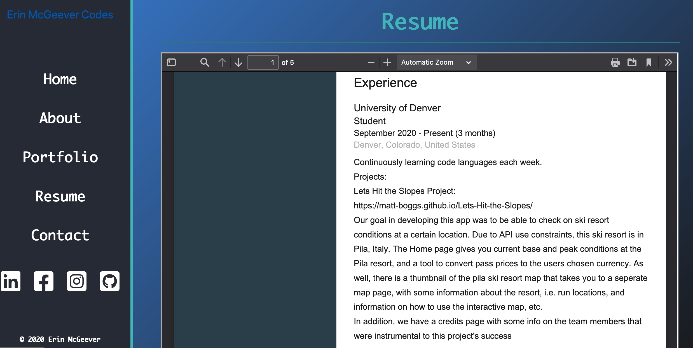
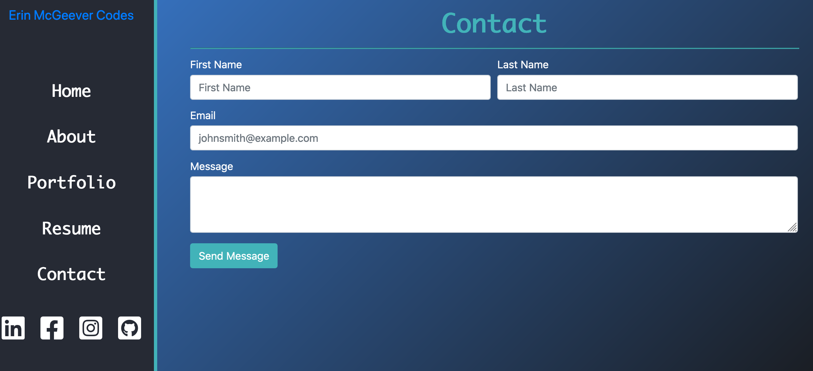

# Portfolio2
## Description

This is my web development portfolio, created using HTML, CSS, Javascript, and Bootstrap.

## Process

I started out researching which template I wanted to use. Then I adapted it to fit my information.

## Webiste

Here is the link to the <a href ="https://mcgeevee.github.io/Portfolio2" >website</a>

## License

<a href="https://choosealicense.com/licenses/mit/#">MIT</a> License
